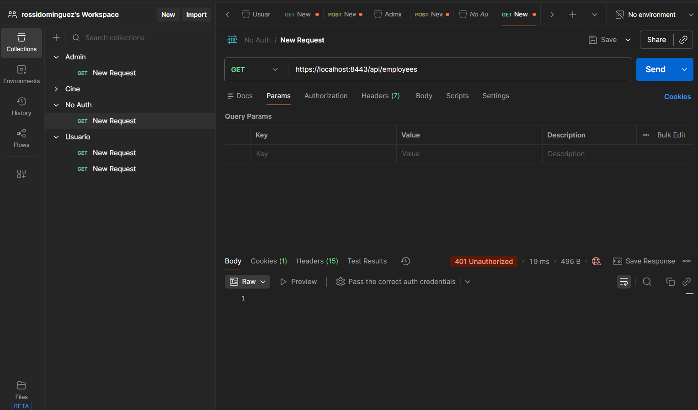
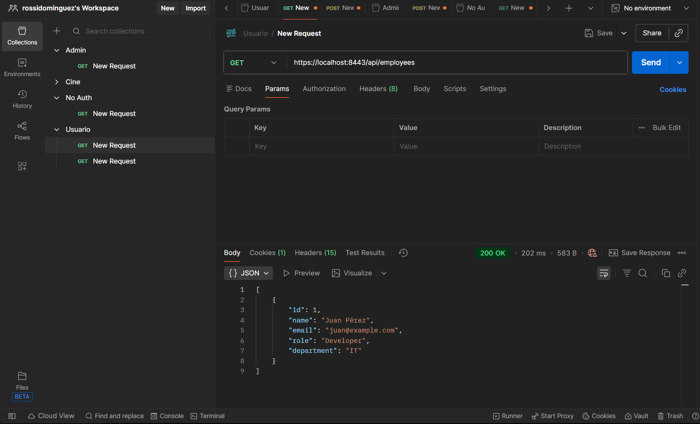
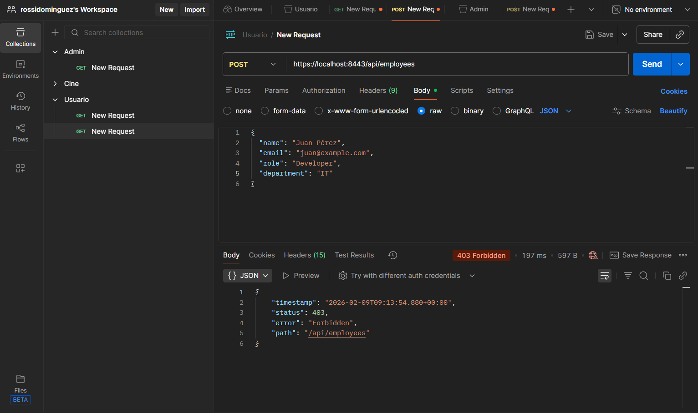
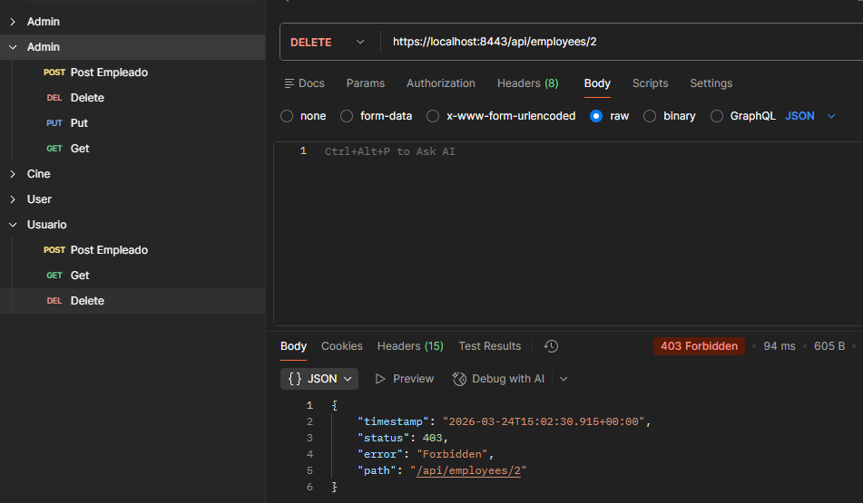
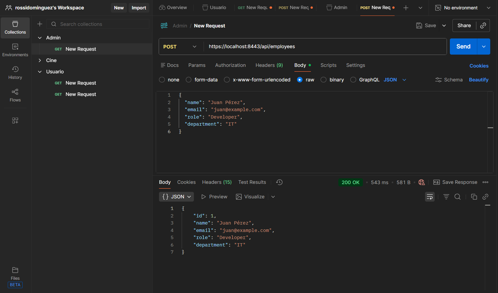
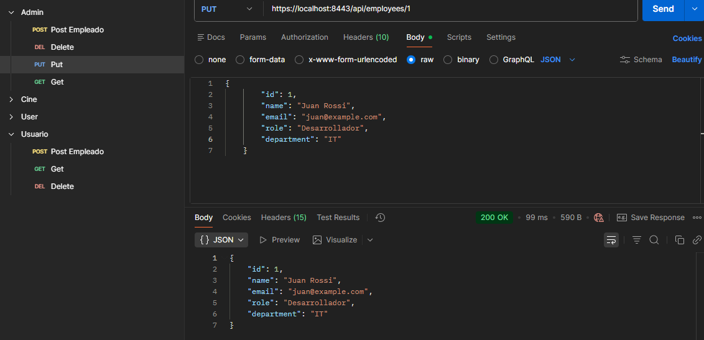
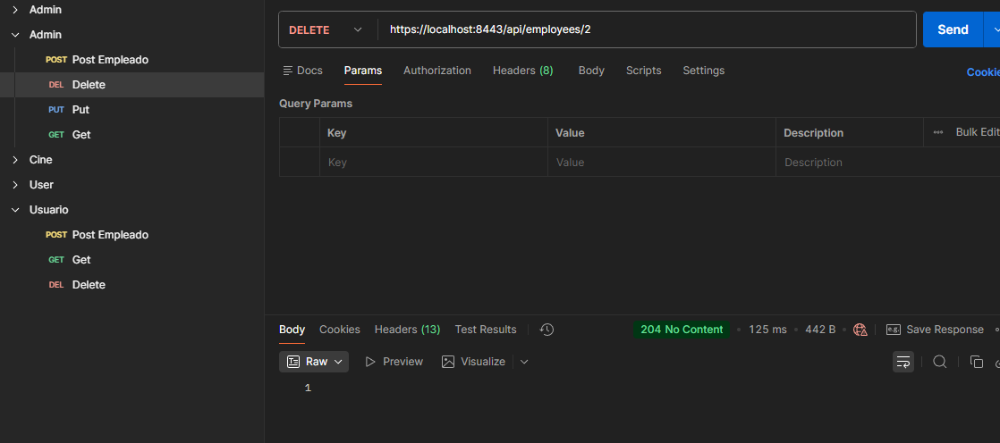

# PSP Dual API - Employee Service

Este archivo documenta la implementación del servicio REST para la actividad "PSP Actividad DUAL".

La aplicación gestiona `Employees` (RA4) e implementa seguridad básica con roles (RA5).

---

### 📸 Capturas de Pantalla de las Pruebas

A continuación se adjuntan las capturas que demuestran el funcionamiento de la API y el control de acceso mediante roles:

**1. Acceso sin autenticación (401 Unauthorized):**


**2. Listar empleados como usuario normal (GET):**


**3. Intentar crear empleado como usuario normal (403 Forbidden):**


**4. Intentar eliminar empleado como usuario normal (403 Forbidden):**


**5. Crear empleado como administrador (POST):**


**6. Actualizar empleado como administrador (PUT):**


**7. Eliminar empleado como administrador (DELETE):**


---


## Tecnologías
- Java 17
- Spring Boot 3.2.2 (Web, Data JPA, Security, Validation)
- H2 Database (En memoria)

## Ejecutar la aplicación
Requiere Maven.

```bash
mvn spring-boot:run
```
O usando el wrapper si está disponible:
```bash
./mvnw spring-boot:run
```

La aplicación iniciará en `https://localhost:8443`.

## Seguridad (RA5)
El sistema implementa Autenticación Básica (Basic Auth).

| Usuario | Contraseña | Rol | Permisos |
| :--- | :--- | :--- | :--- |
| `user` | `password` | `USER` | Solo lectura (GET) |
| `admin` | `admin` | `ADMIN` | Lectura y Escritura (GET, POST, PUT, DELETE) |

## Endpoints (RA4)

**Base URL:** `/api/employees`

### 1. Listar empleados (GET)
- **URL:** `/api/employees`
- **Auth:** Requiere ser `USER` o `ADMIN`.
- **Respuesta:** JSON Array de empleados.

### 2. Obtener un empleado (GET)
- **URL:** `/api/employees/{id}`
- **Auth:** Requiere ser `USER` o `ADMIN`.
- **Respuesta:** JSON Object del empleado o 404.

### 3. Crear empleado (POST)
- **URL:** `/api/employees`
- **Auth:** Requiere ser `ADMIN`.
- **Body:**
```json
{
  "name": "Juan Pérez",
  "email": "juan@example.com",
  "role": "Developer",
  "department": "IT"
}
```

### 4. Actualizar empleado (PUT)
- **URL:** `/api/employees/{id}`
- **Auth:** Requiere ser `ADMIN`.
- **Body:** (mismo formato que POST)

### 5. Eliminar empleado (DELETE)
- **URL:** `/api/employees/{id}`
- **Auth:** Requiere ser `ADMIN`.

## Pruebas (Evidencia)

### Ejemplo con CURL

**Listar sin auth (Fallo 401):**
```bash
curl -k -v https://localhost:8443/api/employees
```

**Listar como usuario normal:**
```bash
curl -k -u user:password https://localhost:8443/api/employees
```

**Crear empleado como admin:**
```bash
curl -k -u admin:admin -X POST https://localhost:8443/api/employees \
-H "Content-Type: application/json" \
-d '{"name":"Ana Gomez", "email":"ana@test.com", "role":"Manager", "department":"HR"}'
```

**Intentar crear como usuario normal (Fallo 403 Forbidden):**
```bash
curl -k -u user:password -X POST https://localhost:8443/api/employees \
-H "Content-Type: application/json" \
-d '{"name":"Hacker", "email":"hacker@test.com", "role":"Bad", "department":"None"}'
```


## Justificación Técnica y Cumplimiento de RAs

En esta sección se detalla cómo el proyecto aborda los criterios de evaluación de la asignatura.

### RA4: Desarrollo de aplicaciones que ofrecen servicios en red
- **Uso de Framework Estándar:** Se ha utilizado **Spring Boot 3.2.2**, un estándar industrial avanzado, asegurando que la solución sea escalable y profesional.
- **Arquitectura REST:** La implementación de endpoints `GET`, `POST`, `PUT` y `DELETE` sigue el estándar REST para la interoperabilidad del servicio.
- **Gestión de Concurrencia:** La aplicación utiliza el pool de hilos gestionado por el servidor Tomcat embebido, permitiendo la comunicación simultánea de varios clientes sin bloqueos.
- **Documentación de API:** Se proporciona este documento detallando rutas y formatos de datos, así como ejemplos de prueba reales con `curl`.

### RA5: Protección de aplicaciones y datos
- **Seguridad basada en Roles (RBAC):** Se implementa control de acceso mediante roles (`ROLE_USER`, `ROLE_ADMIN`) usando **Spring Security** para limitar las acciones de escritura solo a administradores.
- **Programación Segura y Validación:** Se utiliza la librería **Jakarta Validation** en la entidad `Employee` para prevenir la entrada de datos nulos o mal formados, garantizando la integridad de la información almacenada.
- **Políticas de Acceso:** Se ha configurado una cadena de filtros de seguridad (`SecurityFilterChain`) que intercepta cada petición y verifica las credenciales y permisos antes de permitir el acceso al recurso.
- **Evidencia de Funcionamiento:** El sistema está diseñado para rechazar peticiones no autorizadas con códigos de estado HTTP estándar (`401 Unauthorized` y `403 Forbidden`).
- **Transmisión Segura (SSL/TLS):** Se ha configurado el protocolo **HTTPS** sobre el puerto 8443 mediante un certificado auto-firmado, cumpliendo con el requisito de uso de sockets seguros para la transmisión de información.


